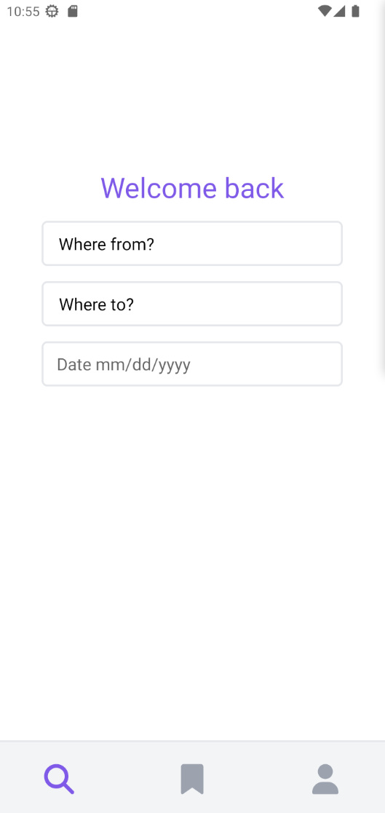

# FlightOwl Mobile

By Ian Shakespeare

## Description

The mobile app implementation of FlightOwl. App is built using React Native with Expo. Data is fetched and client side rendered using AxiosJS. Data is fetched from flightowl-api. Styling is done with Nativewind.

FlightOwl is the all-in-one web and mobile app for finding and saving flights. FlightOwl offers a simple interface for flight searching. Flights can be saved and updated, meaning the user can easily save flights if they aren't ready to purchase.
